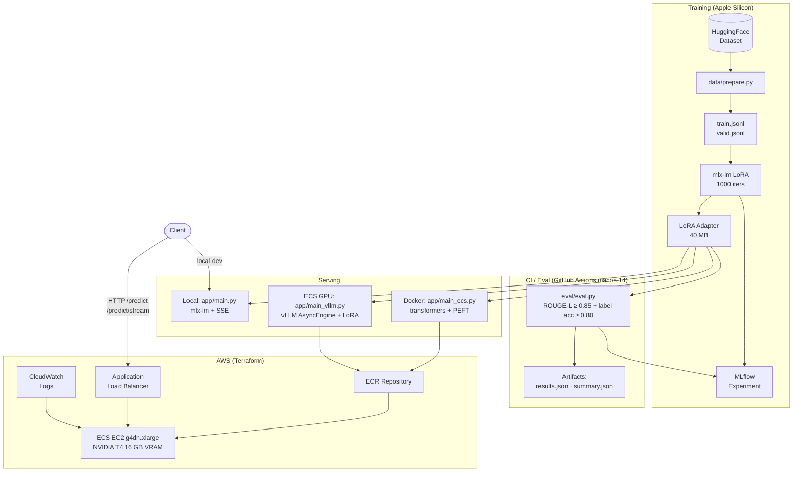

# Financial Sentiment LLM

[](https://github.com/matthew-fitzgerald123/financial-sentiment-llm/actions/workflows/eval.yml)
[](https://github.com/matthew-fitzgerald123/financial-sentiment-llm/actions/workflows/test.yml)


Fine-tuned Mistral-7B for financial sentiment classification using LoRA on Apple Silicon. Exposes a FastAPI service with both batch and SSE streaming inference, containerised with Docker, deployed to AWS ECS via Terraform, and gated by a CI eval pipeline on every push.

## Results

| Model | ROUGE-1 | ROUGE-L | Label Accuracy |
|---|---|---|---|
| Base Mistral-7B-Instruct-v0.3 | 0.113 | 0.094 | — |
| Fine-tuned (LoRA) | 0.970 | 0.970 | 0.95+ |

The base model can classify sentiment but generates it in its own verbose, inconsistent format. The fine-tuned model reliably produces structured output (`Sentiment: {label}. This statement reflects...`) that matches the target format with near-perfect fidelity. Label accuracy measures the fraction of predictions where the extracted sentiment label matches the ground-truth label, independently of wording.

## Architecture



## Stack

- **Model**: `mlx-community/Mistral-7B-Instruct-v0.3-4bit`
- **Fine-tuning**: LoRA via [mlx-lm](https://github.com/ml-explore/mlx-lm) (Apple Silicon native)
- **Dataset**: [nickmuchi/financial-classification](https://huggingface.co/datasets/nickmuchi/financial-classification) (4,551 train / 506 test)
- **Tracking**: MLflow
- **Serving**: FastAPI + uvicorn
- **Infra**: Docker · AWS ECS EC2 (g4dn.xlarge, NVIDIA T4) · Terraform · GitHub Actions

## Model Card

| | |
|---|---|
| Base model | `mistralai/Mistral-7B-Instruct-v0.3` (4-bit quantized) |
| Fine-tuning method | LoRA (rank=8, scale=10.0, layers=16) |
| Optimizer | AdamW, lr=5e-5 |
| Training iterations | 1000 |
| Batch size | 2 (grad checkpointing enabled) |
| Hardware | Apple Silicon (Metal) |
| Approx. training time | ~45 min |
| Adapter size | 40MB |

## Quickstart

```bash
# Install deps
make install
pip install -r requirements-dev.txt   # test dependencies (pytest, httpx)

# Prepare dataset (downloads ~500KB)
make prepare

# Fine-tune (~45 min on M2/M3 Pro)
make train

# Evaluate base vs fine-tuned
make eval

# Evaluate on bundled out-of-domain fixture (earnings calls, 10-K filings)
make eval-ood

# Run test suite (no model weights required)
make test

# Merge LoRA adapter into base weights and re-quantize (requires trained adapter)
make merge

# Benchmark LoRA scale vs latency/quality (requires trained adapter)
make benchmark

# Serve locally at http://localhost:8080 (Apple Silicon / mlx-lm)
make serve

# Serve merged model (no adapter overhead) — run 'make merge' first
make serve-merged

# Serve ECS-compatible backend (transformers + PEFT; MOCK_MODE avoids loading weights)
make serve-ecs

# Serve with vLLM GPU backend (requires CUDA; use MOCK_MODE=true without a GPU)
MOCK_MODE=true make serve-vllm
```

## Inference

**Model info:**
```bash
curl http://localhost:8080/model/info
```

```json
{
  "model_id": "mistralai/Mistral-7B-Instruct-v0.3",
  "adapter_path": "./mistral-finetuned",
  "model_version": "mistral-7b-finance-mlx-lora-v1",
  "model_loaded": true,
  "merged": false
}
```

**Batch:**
```bash
curl -X POST http://localhost:8080/predict \
  -H "Content-Type: application/json" \
  -d '{"question": "Classify the sentiment: \"Operating margins expanded by 300 basis points.\""}'
```

```json
{
  "answer": "Sentiment: positive. This statement reflects favorable financial conditions.",
  "label": "positive",
  "explanation": "This statement reflects favorable financial conditions.",
  "model_version": "mistral-7b-finance-mlx-lora-v1"
}
```

**Streaming (SSE):**
```bash
curl -X POST http://localhost:8080/predict/stream \
  -H "Content-Type: application/json" \
  -d '{"question": "Classify the sentiment: \"Revenue declined 8% amid restructuring charges.\""}' \
  --no-buffer
```

```
data: {"token": "Sentiment", "model_version": "mistral-7b-finance-mlx-lora-v1"}
data: {"token": ":", "model_version": "mistral-7b-finance-mlx-lora-v1"}
data: {"token": " negative", "model_version": "mistral-7b-finance-mlx-lora-v1"}
...
data: [DONE]
```

## Eval Details

ROUGE-L of 0.970 is high because the target format is short and structured. The remaining 3% gap comes from edge cases where the model disagrees with the annotator label (e.g. predicting neutral for ambiguous expansion announcements). **Label accuracy** (exact match of the `positive / neutral / negative` token) is now reported alongside ROUGE-1 and ROUGE-L in the output table, giving a more interpretable view of classification quality for this 3-class task.

`eval/eval.py` accepts CLI arguments so it can be pointed at any JSONL file without editing source:

```bash
# Default — evaluates on data/valid.jsonl
make eval

# Bundled OOD fixture (earnings calls, 10-K filings) — no extra data needed
make eval-ood
# Equivalent: python eval/eval.py --data data/ood_sample.jsonl --n 10

# Custom out-of-domain dataset
python eval/eval.py --data /path/to/ood.jsonl --n 100

# Custom adapter path
python eval/eval.py --adapter /path/to/my-adapter --n 50
```

Full per-example results in `eval/results.json` after running `make eval`. Aggregate metrics (ROUGE-1, ROUGE-L, label accuracy for both models) are saved to `eval/summary.json` and read by the CI gate. All metrics and the gate result are also logged to the MLflow experiment `mistral-finance-mlx-lora`.

## What I'd Do Next

- **Richer output**: ✓ response now includes `label` and `explanation` fields parsed from structured model output
- **Harder eval**: ✓ `data/ood_sample.jsonl` bundles 10 earnings-call / 10-K examples; `make eval-ood` runs the full OOD evaluation in one command
- **Merge + requantize**: ✓ `scripts/merge.py` fuses the LoRA adapter into the base weights and re-quantizes (`make merge`); `make serve-merged` loads the fused model directly via `MERGED_MODEL_PATH` with no adapter overhead, and `/model/info` reports `merged: true` in that mode
- **GPU serving**: ✓ `app/main_vllm.py` serves via `vllm.AsyncLLMEngine` with LoRA support; Terraform switches the ECS cluster from Fargate to an EC2 Auto Scaling Group of `g4dn.xlarge` GPU instances using the ECS-optimized GPU AMI; run locally with `make serve-vllm` (set `MOCK_MODE=true` without a GPU)
